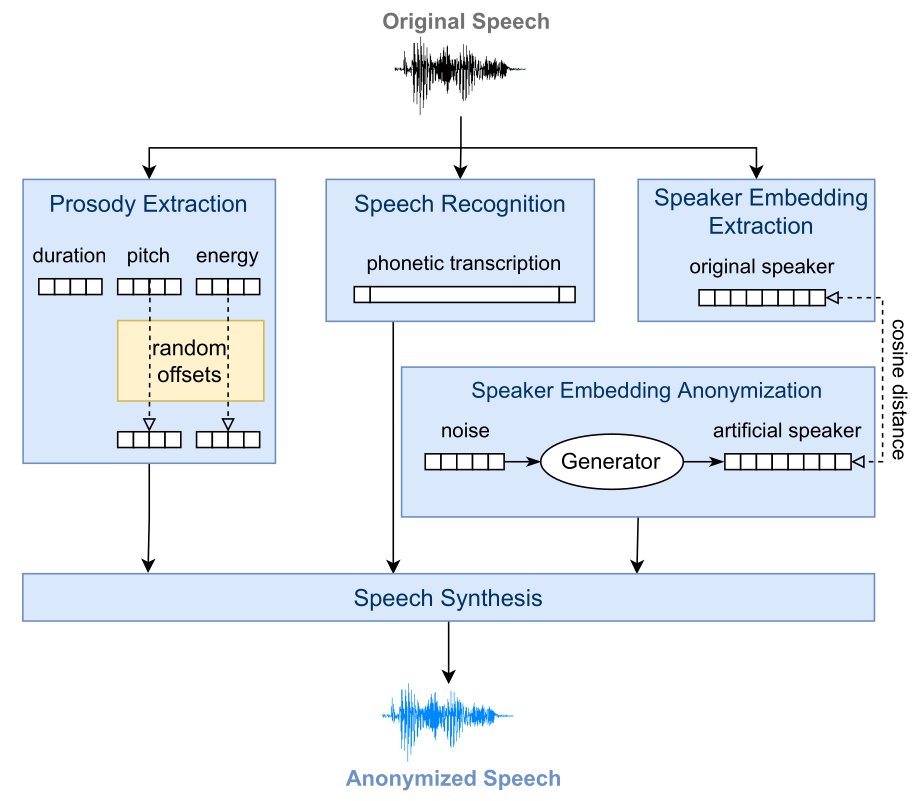

# STTTS Pipeline

The STTTS (short for Speech-to-Text-to-Speech) speaker anonymization pipeline is an implementation of [this paper](https://www.isca-archive.org/interspeech_2022/meyer22b_interspeech.pdf) 
which further extends [this paper](https://www.isca-archive.org/interspeech_2022/meyer22b_interspeech.pdf) and [this paper](https://ieeexplore.ieee.org/abstract/document/10022601).
The key ideas of this system are to reduce the linguistic content of the input speech to phonetic transcriptions that
reveal as little information about the speaker as possible, generate artificial target speakers using a generative adversarial network (GAN), 
and to synthesize the anonymized speech based on the unmodified transcription, slightly modified representations of the input speech's prosody, and the artificial speaker embedding.

The implementations of this system are based on [https://github.com/DigitalPhonetics/speaker-anonymization](https://github.com/DigitalPhonetics/speaker-anonymization) and [https://github.com/DigitalPhonetics/VoicePAT](https://github.com/DigitalPhonetics/VoicePAT).

## Modules
The pipeline consists of four modules:

### Speech Recognition
The ASR model is an end-to-end model based on the hybrid CTC/attention architecture, using a Branchformer encoder and a Transformer decoder.
It is implemented in the [ESPnet](https://github.com/espnet/espnet) toolkit and similar to [ESPnet's LibriTTS recipe](https://github.com/espnet/espnet/tree/master/egs2/libritts/asr1).
The model performs phonetic speech recognition, i.e., it output the transcribed speech as phonetic sequences. 
To make life easier for the speech synthesis, it also outputs word boundaries and punctuation.
The start of each transcribed utterance is marked with '\~' and its end with '\~#'.

### Prosody Extraction and Modification
The prosody of the input speech is extracted on the phone level with three values per phone: pitch (F0), energy, and duration.
This results in three 1-dimensional vectors for pitch, energy and duration.
The pitch and energy values are normalized by the mean of the utterance's values in order to remove speaker-specific values.
In this way, the extracted prosody can directly be used as input to the speech synthesis, regardless of the speaker's gender or age.
However, the prosody contour might still reveal some information about the speaker.
Therefore, it is possible to randomly modify the pitch and energy values of each phone by multiplying them with a random value within a given range (offsets).
This range usually centers around 100 (%), and a different value is samples within that range for each phone.
In the default config, we use a range of [60, 140] which indicate percentages. 
This means that each value can be reduced to up to 60% of its original value or increased to up to 140%.
It is also possible that a value is not changed at all if 100% is sampled as its random offset.
The random modification removes speaker-specific patterns while avoiding to change the prosody and thus the conveyed meaning of the original utterance too much.

### Speaker Embedding Extraction and Modification
The speaker information is extracted from the input speech as a GST-based speaker style embedding.
In contrast to speaker embeddings like x-vector or ECAPA-TDNN, this speaker embedding is supposed to contain more than just the pure speaker information but als the style of the speech (e.g., the emotion).
This does not play a role for the anonymization but it makes the speaker embeddings more diverse and improves the quality of the synthesized speech.
The speaker extraction model is trained jointly with the speech synthesis.
A second model is used to generate the targets for the speaker anonymization.
This model is a Wasserstein GAN that has learned to transform random noise into vectors of the same shape and distribution as the speaker embeddings of real speakers.
The generated embeddings do not correspond to real speakers, and since the GAN was not trained directly on original speaker embeddings but only on their distribution, it is unlikely that the GAN imitates the training speakers.
During anonymization of an utterance, the GAN either generates a new embedding or samples one randomly from a set of pre-generated embeddings.
If this speaker embedding is too similar to the original speaker (cosine distance < 0.3), a new speaker embedding is sampled.

### Speech Synthesis
The speech synthesis module consists of a FastSpeech2-based Text-to-Speech (TTS) model and a HiFiGAN vocoder.
It is implemented in the [IMS Toucan toolkit](https://github.com/DigitalPhonetics/IMS-Toucan).
The TTS transforms the phonetic sequence into articulatory features, and uses them together with the prosody sequences and artificial speaker embedding to generate the output spectrogram.
The vocoder then transforms this spectrogram into the anonymized waveform.

## Usage
This pipeline can be run by specifying the [anon_sttts.yaml](../../../configs/anon_sttts.yaml) configuration for the anonymization.
Please be aware that, depending on the size of your dataset, the anonymization can take some time.
Intermediate representations of all modules are saved to disk.
If the pipeline is run a second time, the intermediate representations will be loaded by default, and only recomputed if explicitly specified in order to reduce the run time.
Because of the long run time of the full anonymization pipeline, we provide the intermediate representations for text transcriptions, prosody extraction and speaker embedding extraction for the LibriSpeech data. 
When running the pipeline, these representations are automatically downloaded and their computation is skipped during anonymization.